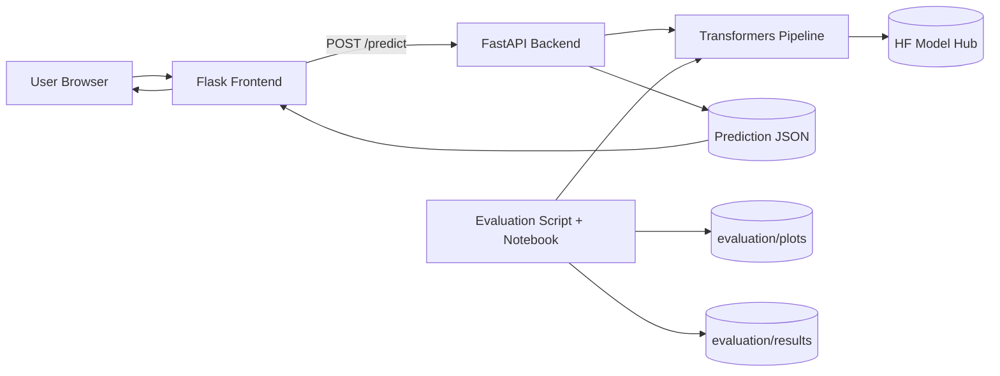
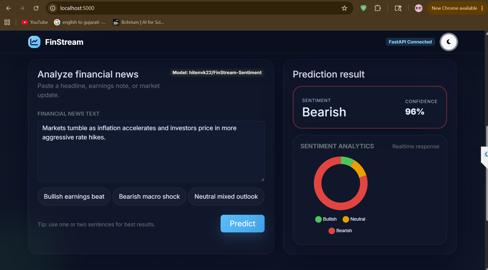
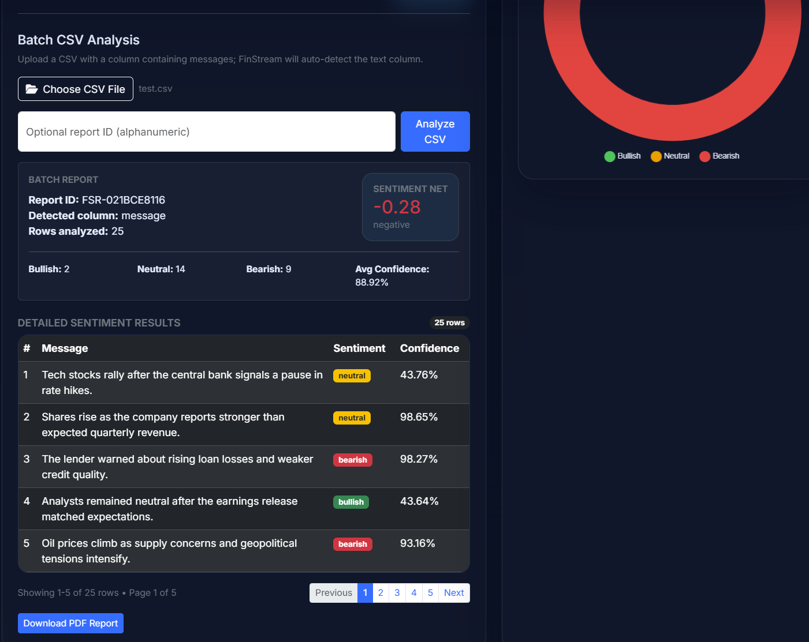
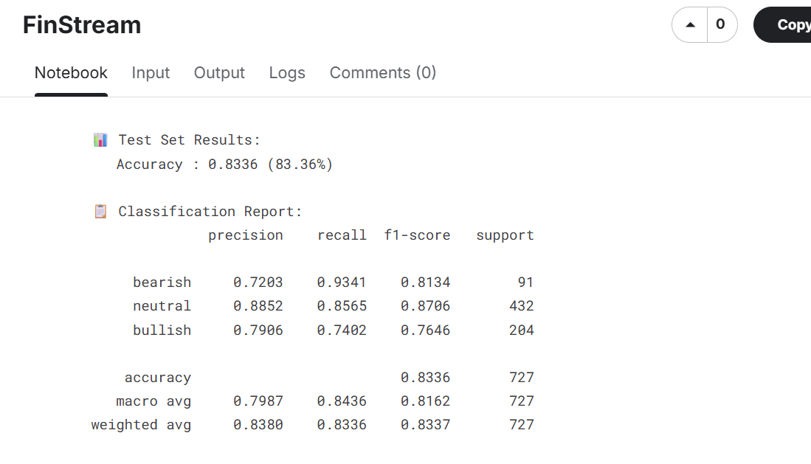
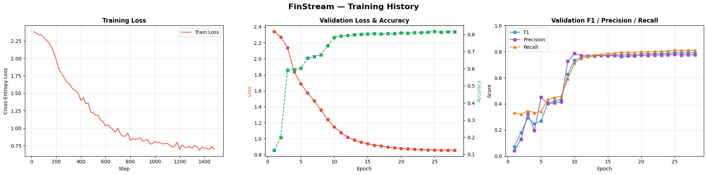
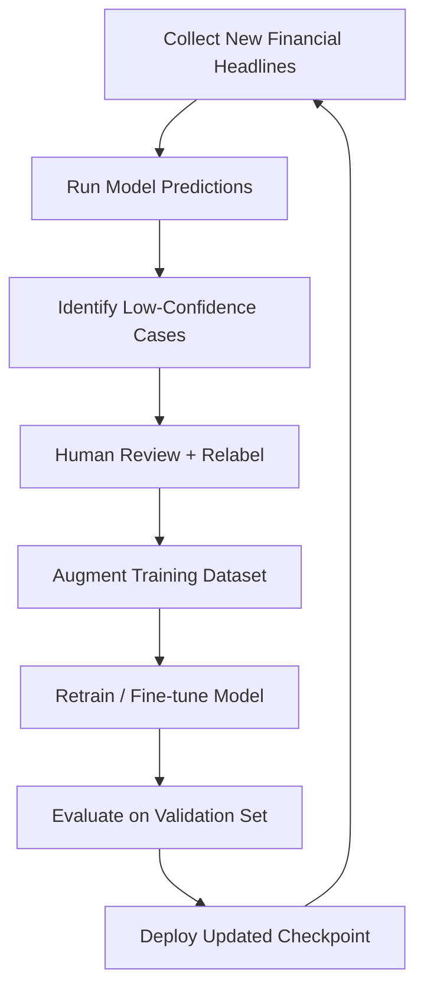

# FinStream: AI-Powered Financial Sentiment Intelligence


FinStream is a full-stack AIML project for real-time financial news sentiment analysis. It combines a production-grade FastAPI inference backend, a modern Flask frontend dashboard, and a complete offline evaluation pipeline for model performance tracking.

## Project Overview

### What FinStream solves
- Ingests financial news text from users.
- Runs transformer-based sentiment inference using Hugging Face.
- Returns actionable sentiment classes with confidence scores.
- Visualizes predictions in an interactive, portfolio-ready UI.

### Current model
- Hugging Face model: [hitenvk22/FinStream-Sentiment](https://huggingface.co/hitenvk22/FinStream-Sentiment)

## Architecture Diagram



## Features

- Modern responsive frontend with dark mode and animations.
- Real-time prediction requests with `fetch()`.
- Sentiment output with confidence score and color-coded cards.
- FastAPI backend with startup model loading and CORS support.
- Health check endpoint for uptime monitoring.
- Structured exception handling and logging.
- GPU-aware inference (CUDA if available, CPU fallback).
- Full evaluation suite with metrics and visual diagnostics.
- Render-ready deployment setup using Procfile-based launch commands.

## Tech Stack

- Backend: FastAPI, Uvicorn, Transformers, PyTorch, Pydantic
- Frontend: Flask, Bootstrap 5, Chart.js, custom CSS/JS
- Evaluation: scikit-learn, pandas, matplotlib, seaborn
- Platform: Render
- Tooling: VS Code, Jupyter Notebook

## Project Structure

```text
FinStream/
├── backend/
│   ├── app/
│   │   ├── api/
│   │   ├── core/
│   │   └── services/
│   ├── main.py
│   ├── requirements.txt
│   └── Procfile
├── frontend/
│   ├── templates/index.html
│   ├── static/style.css
│   ├── static/app.js
│   ├── app.py
│   ├── requirements.txt
│   └── Procfile
├── evaluation/
│   ├── evaluate_model.py
│   ├── evaluate_model.ipynb
│   ├── plots/
│   └── results/
├── screenshots/
├── docs/
└── README.md
```

## Screenshots

The screenshots below are taken from the current FinStream UI and show both the single-text prediction flow and the final portfolio-style dashboard.

### Single Text Prediction



This view shows the main sentiment form, the live FastAPI-connected prediction result, and the color-coded analytics chart. In the captured example, the model returns a bearish label with high confidence for a market headline.

### CSV Batch Prediction



This view is used for CSV upload testing, batch sentiment processing, report ID generation, and PDF report download. It demonstrates the batch workflow for message-wise sentiment analysis and sentiment net summary reporting.

### Model Evaluation Snapshot



This snapshot captures a notebook test-set result with 83.36% accuracy and a full classification report for bullish, neutral, and bearish labels.

### Training History Snapshot



This plot shows training loss trending downward, validation loss stabilizing, and validation F1 / precision / recall converging across epochs.

## GIF Demo

Add a short walkthrough GIF and embed it below:

```md

```

## Model Training Details

- Model family: Transformer-based sequence classification.
- Finetuned checkpoint: `hitenvk22/FinStream-Sentiment`.
- Label space in app layer: `bullish`, `neutral`, `bearish`.
- Inference framework: `transformers.pipeline("sentiment-analysis")`.

For deeper training metadata, refer to the model card on Hugging Face.

## Hugging Face Integration

The backend dynamically loads the model at startup:

- Reads model name from environment variable (`MODEL_NAME` defaulting to `hitenvk22/FinStream-Sentiment`).
- Optionally uses `HF_TOKEN` for authenticated model pulls.
- Initializes tokenizer + model and wraps them in a sentiment pipeline.

## FastAPI Backend Explanation

- Entrypoint initializes app metadata, CORS, and exception handlers.
- Lifespan startup loads the model once for all requests.
- `POST /predict` performs inference and returns normalized business labels.
- `GET /health` provides readiness and device info.

## Flask Frontend Explanation

- Serves a polished dashboard for sentiment prediction.
- Sends asynchronous requests to FastAPI using `fetch()`.
- Displays label, confidence, and chart-based analytics.
- Includes loading indicators, error alerts, and theme toggle.

## Active Learning Workflow



## Installation Guide

### 1. Clone

```bash
git clone <your-repo-url>
cd FinStream
```

### 2. Create environment

```bash
python -m venv .venv
# Windows
.venv\Scripts\activate
# macOS/Linux
source .venv/bin/activate
```

### 3. Install dependencies

```bash
pip install -r requirements.txt
```

## Local Setup Guide

### Backend

```bash
uvicorn backend.main:app --host 0.0.0.0 --port 8000 --reload
```

### Frontend

In another terminal:

```bash
cd frontend
# Windows PowerShell
$env:FASTAPI_BASE_URL="http://localhost:8000"
python app.py
```

```bash
# macOS/Linux
FASTAPI_BASE_URL=http://localhost:8000 python app.py
```

Open `http://localhost:5000`.

## VS Code Setup

Recommended extensions:
- Python
- Pylance
- Jupyter
- Black Formatter (optional)

Recommended workflow:
- Select `.venv` interpreter.
- Run backend and frontend in separate integrated terminals.
- Use notebook mode for evaluation experiments.

### Endpoints

#### `GET /health`

Returns service and model readiness.

#### `POST /predict`

Request body:

```json
{
	"text": "Markets rallied after the central bank signaled a possible rate pause."
}
```

Response body:

```json
{
	"label": "bullish",
	"confidence": 0.98
}
```

## Example API Requests

```bash
curl -X POST "http://localhost:8000/predict" \
	-H "Content-Type: application/json" \
	-d '{"text":"Shares rose on stronger than expected earnings."}'
```

```javascript
const response = await fetch("http://localhost:8000/predict", {
	method: "POST",
	headers: { "Content-Type": "application/json" },
	body: JSON.stringify({ text: "Oil prices fell as demand outlook weakened." })
});

const data = await response.json();
console.log(data);
```

## Model Evaluation Metrics

Latest run (`evaluation/evaluate_model.py`) on 24 custom financial samples:

| Metric | Value |
|---|---:|
| Accuracy | 0.4583 |
| Precision (weighted) | 0.4242 |
| Recall (weighted) | 0.4583 |
| F1-score (weighted) | 0.4386 |

The notebook-based training screenshot above shows a separate test-set summary with 83.36% accuracy and the corresponding class-wise report.

Generated artifacts:
- `evaluation/results/metrics.json`
- `evaluation/results/classification_report.txt`
- `evaluation/results/classification_report.csv`
- `evaluation/results/prediction_logs.csv`
- `evaluation/plots/confusion_matrix_heatmap.png`
- `evaluation/plots/prediction_distribution.png`
- `evaluation/plots/confidence_histogram.png`
- `evaluation/plots/sentiment_pie_chart.png`

## Future Improvements

- Expand and rebalance labeled financial datasets.
- Add confidence calibration and thresholding.
- Integrate active-learning annotation UI.
- Add CI/CD workflows and automated regression tests.
- Add role-based dashboard views and historical trend tracking.
- Optimize latency with quantization or model distillation.

